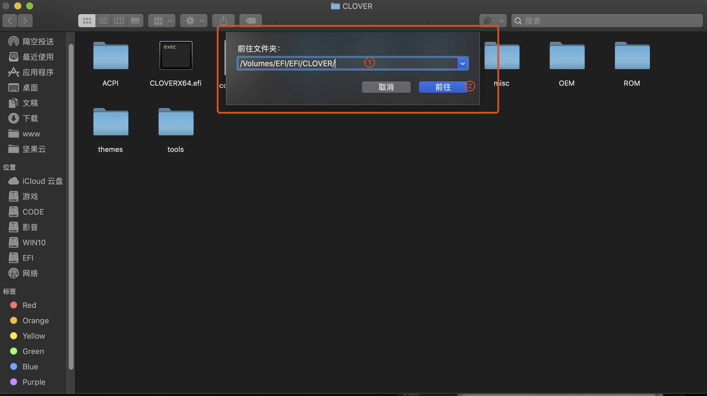
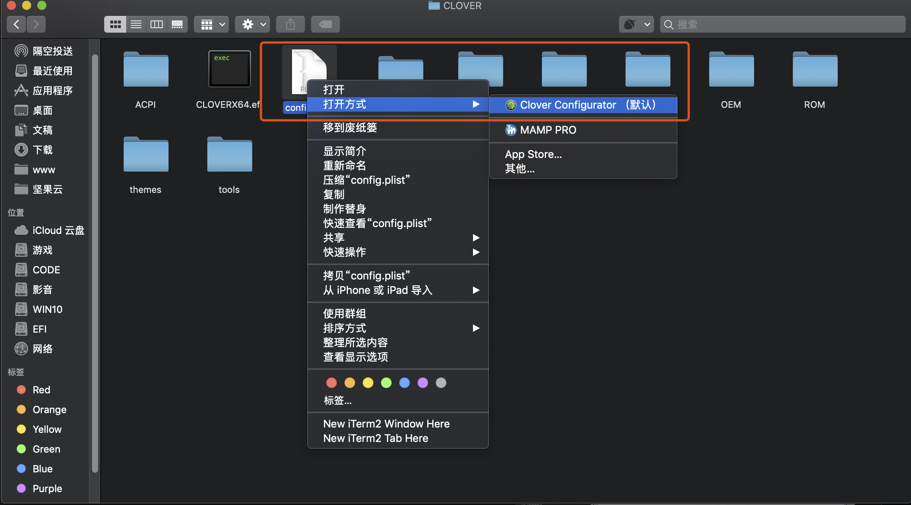
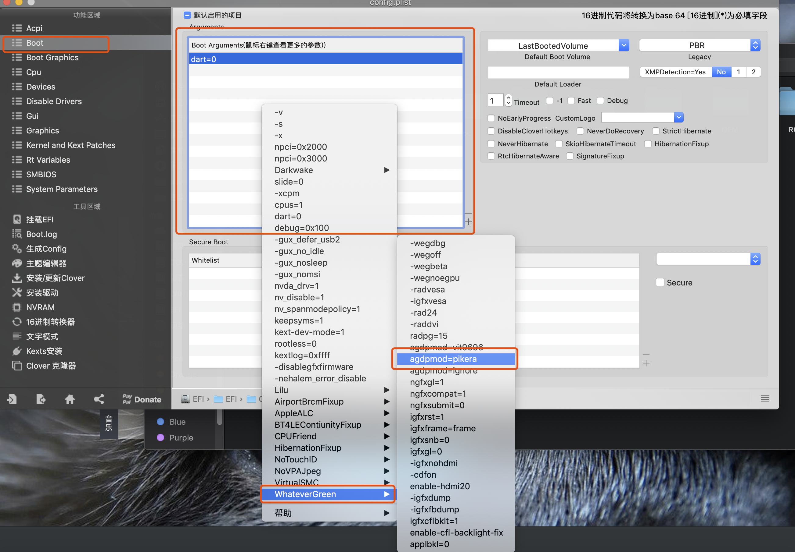
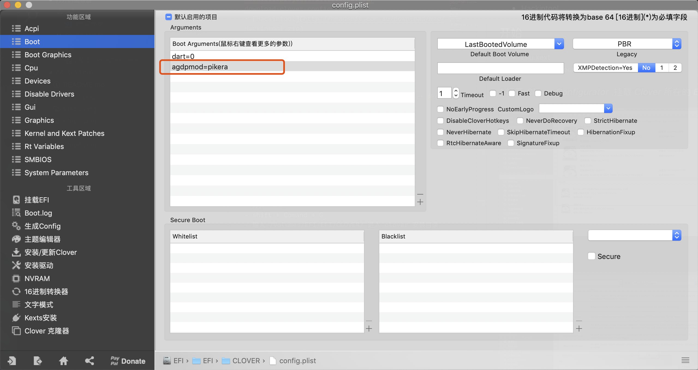

# 黑苹果启用 5k显示/ 解决多dp 5k显示器识别成多个显示器

## 所需工具

- [Clover Configurator](https://mackie100projects.altervista.org/download-clover-configurator/)
- [Hackintool](http://headsoft.com.au/download/mac/Hackintool.zip)

## 开始

- Lilu.kext
- WhateverGreen.kext 

### 1.打开 *Clover Configurator* ,挂载 *Clover* 所在的 *EFI* 分区

### 2. 安装 kext

### 3.增加 5k 启动参数

- 打开 *访达*
- shift + Comand + G 
- 输入 /Volumes/EFI/EFI/CLOVER/ 进入 clover 安装目录

鼠标右键点击 `Boot Arguments` 空白处，如图操作，增加5K启动参数

完成操作之后，`Boot Arguments` 多一条 `agdpmod=pikera`。

保存配置文件，并重启电脑。