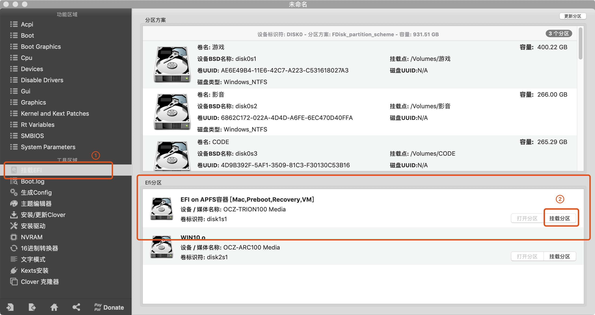
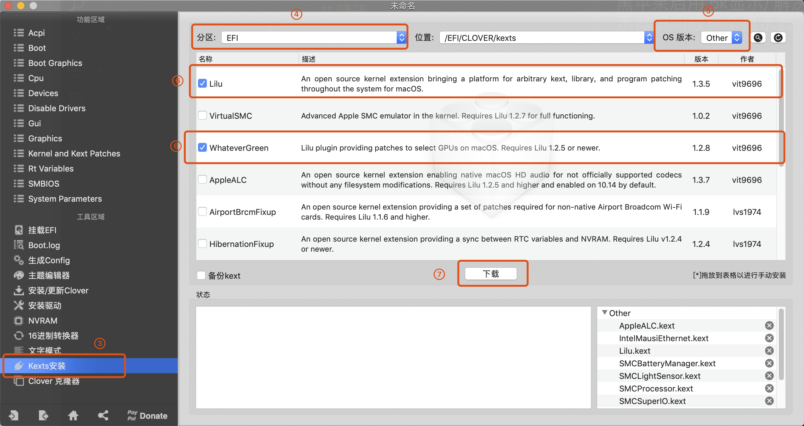

# 黑苹果启用 5k显示/ 解决多dp 5k显示器识别成多个显示器

## 核心

安装必须 `kext` ,已安装直接进入下一步。

- [Lilu.kext](https://github.com/acidanthera/Lilu/releases)  版本:1.35 以上
- [WhateverGreen.kext](https://github.com/acidanthera/WhateverGreen/releases) 版本:1.28 以上

**注意: 使用新LiLu.kext 可能造成依赖Lilu.kext的kext不能正常工作，导致不能进入系统。包含不仅限于(AppleALC.kext)**

clover 增加启动参数

```bash
# Boot 下新增 agdpmod=pikera
<key>Arguments</key>
<string>agdpmod=pikera</string>

#比如你原来是
<key>Arguments</key>
<string>-v</string>

#那么最后结果就是
<key>Arguments</key>
<string>-v agdpmod=pikera</string>
```

重启之后就是5k了。

## FAQ

1. 如何挂载`EFI`分区

[Clover Configurator 下载地址](https://mackie100projects.altervista.org/download-clover-configurator/)



2. 怎么安装`kext`

- 挂载EFI盘
- 将下载的 **.kext 放在 `CLOVER/kexts/Other`

或者直接使用 [Clover Configurator](https://mackie100projects.altervista.org/download-clover-configurator/)
的 `Kexts` 安装



3. 更新 `Lilu.kext` 不能启动怎么办？

[Clover使用教程](https://blog.daliansky.net/clover-user-manual.html)

4. 安装`kext`并且增加了`启动参数`还不是5k?

其他 `kext` 产生冲突